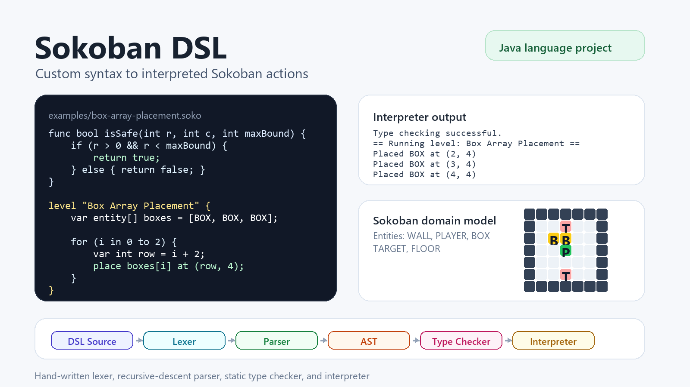
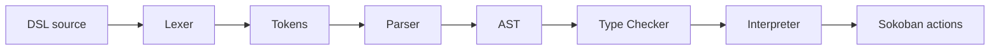

# Sokoban DSL

A course project for designing and executing a small domain-specific language for Sokoban levels.



## Overview

Sokoban DSL is a Java-based programming language project built for a Programming Languages course. The goal of the project is not only to model Sokoban levels, but also to implement the core stages of a small language pipeline:



The language supports variables, typed values, arrays, functions, loops, conditionals, validation statements, and Sokoban-specific commands such as placing entities on the level.

## Language Example

```sokoban
func bool isSafe(int r, int c, int maxBound) {
    if (r > 0 && r < maxBound && c > 0 && c < maxBound) {
        return true;
    } else {
        return false;
    }
}

level "Box Array Placement" {
    var int mapSize = 8;
    var entity[] boxes = [BOX, BOX, BOX];

    for (i in 0 to 2) {
        var int row = i + 2;
        var int col = 4;

        if (isSafe(row, col, mapSize) == true) {
            place boxes[i] at (row, col);
        }
    }

    print "Boxes are placed safely.";
}
```

Example interpreter output:

```text
--- TYPE CHECKER ---
Type checking successful.
--- INTERPRETER ---
== Running level: Box Array Placement ==
Placed BOX at (2, 4)
Placed BOX at (3, 4)
Placed BOX at (4, 4)
Boxes are placed safely.
```

## Features

- Hand-written lexer using regular expressions
- Recursive-descent parser that builds an AST
- AST node model with printable tree structure
- Static type checker with scoped symbol tables
- Interpreter with runtime scopes and function calls
- Sokoban-specific entities: `WALL`, `PLAYER`, `BOX`, `TARGET`, `FLOOR`
- Domain-specific statements: `level`, `place`, and `validate`
- Built-in support for arrays, indexing, arithmetic, comparisons, logical operators, `if/else`, `for`, `return`, and `print`
- Runtime checks for cases such as division by zero, undefined variables, invalid array indexing, and invalid placements

## Project Structure

```text
.
├── AstNode.java          # AST representation and tree printing
├── Lexer.java            # Token definitions and lexical analyzer
├── Parser.java           # Recursive-descent parser
├── TypeChecker.java      # Static semantic checks
├── SymbolTable.java      # Scoped variables, functions, records, and types
├── Interpreter.java      # Executes parsed programs
├── RuntimeState.java     # Grid state model for Sokoban entities
├── Environment.java      # Environment helper for scoped values
├── Errors.java           # Runtime and domain-specific error classes
└── Part2TestRunner.java  # Example programs and test runner
```

## Requirements

- Java 17 or newer is recommended.
- No external dependencies are required.

## Running

Compile all Java files:

```bash
javac *.java
```

Run the included test runner:

```bash
java Part2TestRunner
```

The runner includes valid programs and error cases for the lexer, parser, type checker, and interpreter.

## DSL Concepts

| Concept | Example |
| --- | --- |
| Level definition | `level "Level Name" { ... }` |
| Variable declaration | `var int width = 10;` |
| Entity declaration | `var entity p = PLAYER;` |
| Array declaration | `var entity[] boxes = [BOX, BOX, BOX];` |
| Function | `func bool isSafe(int r, int c, int maxBound) { ... }` |
| Loop | `for (i in 0 to 2) { ... }` |
| Placement | `place BOX at (2, 4);` |
| Validation | `validate "Player initialized": p == PLAYER;` |

More grammar notes and examples are available in [`docs/GRAMMAR.md`](docs/GRAMMAR.md).

## Error Handling

The project demonstrates both general language errors and Sokoban-specific runtime errors:

- Type mismatch, such as assigning a string to an integer
- Division or modulo by zero
- Array index out of range
- Undefined variable access
- Invalid grid placement
- Validation failure support

## Notes

This project focuses on the implementation of a custom language pipeline. The current runner executes embedded sample programs and prints semantic actions to the console. `RuntimeState.java` also provides a grid representation that can be connected to richer map rendering in future iterations.

## Team

- Cemal Gümüş
- Ömer Faruk Demir

## Suggested Repository Description

> A Java-based domain-specific language for defining Sokoban levels, implemented with a hand-written lexer, parser, type checker, and interpreter.

## Suggested Topics

`java` `dsl` `sokoban` `interpreter` `lexer` `parser` `type-checker` `compiler-design` `programming-languages`

