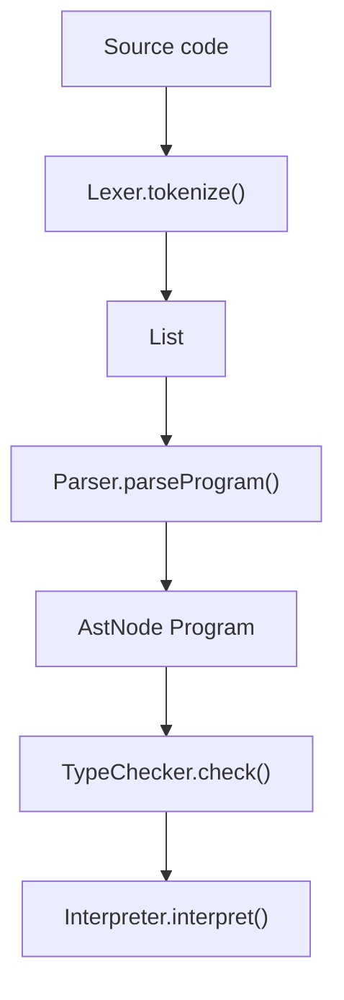

# Sokoban DSL Grammar Notes

This document summarizes the language syntax implemented by the lexer, parser, type checker, and interpreter.

## Program Structure

A program is a sequence of top-level declarations:

```text
program        -> declaration*
declaration    -> recordDecl | funcDecl | varDecl | levelDef
```

Supported top-level declarations:

```sokoban
record Position {
    var int row;
    var int col;
}

func int add(int a, int b) {
    return a + b;
}

var int globalValue = 10;

level "Example" {
    print "Hello from a level.";
}
```

## Types

Built-in types:

```text
int
string
bool
entity
void
```

Array types are supported with `[]`:

```sokoban
var int[] numbers = [1, 2, 3];
var entity[] boxes = [BOX, BOX, TARGET];
```

Custom record types are parsed and stored in the symbol table:

```sokoban
record Tile {
    var int row;
    var int col;
    var entity item;
}
```

## Literals

```text
42
"hello"
true
false
WALL
PLAYER
BOX
TARGET
FLOOR
```

Comments use the following format:

```sokoban
(* This is a comment. *)
```

## Statements

### Variable Declaration

```sokoban
var int width = 10;
var entity player = PLAYER;
```

### If / Else

```sokoban
if (x > 0) {
    print "positive";
} else {
    print "not positive";
}
```

### For Loop

```sokoban
for (i in 0 to 2) {
    print i;
}
```

The interpreter executes the loop inclusively from the start value to the end value.

### Function Declaration and Call

```sokoban
func bool isInside(int row, int col, int size) {
    return row >= 0 && row < size && col >= 0 && col < size;
}

level "Function Call" {
    if (isInside(2, 3, 8) == true) {
        print "inside";
    }
}
```

### Sokoban Placement

```sokoban
place PLAYER at (5, 5);
place WALL at (0, 0);
place boxes[i] at (row, col);
```

### Validation

```sokoban
validate "Distance limit": dist < 10;
```

The interpreter prints whether the validation passes or fails.

### Print

```sokoban
print "Boxes are placed safely.";
print dist;
```

## Expressions

The parser implements operator precedence for:

```text
||
&&
== !=
< > <= >=
+ -
* / %
! -
```

Examples:

```sokoban
var int dist = dx + dy;
var bool safe = r > 0 && r < maxBound;
var bool different = PLAYER != BOX;
```

## Pipeline



## Example Programs

See the `examples/` directory for sample DSL programs:

- `border-generation.soko`
- `box-array-placement.soko`
- `distance-check.soko`

